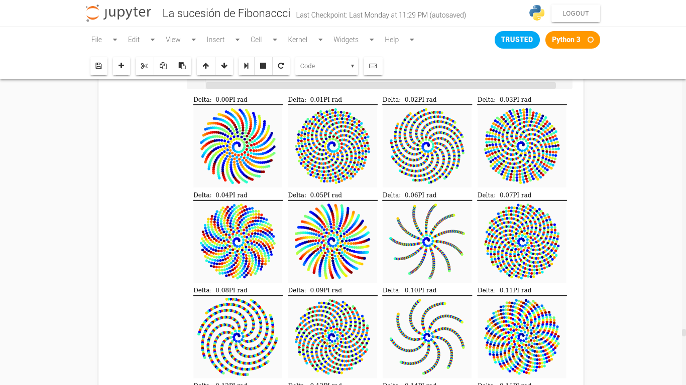

# La sucesión de Fibonacci

[][1]
[![BSD-3-Clause][2]][1] [![Python][3]][1] [![Jupyter Notebook][4]][1] [![Math][5]][1]

*Notebook* acerca de la sucesión de Fibonacci, algunos aspectos matemáticos matematicos, gráficos y ejempos de implementación implementación.

## How to use

1. Clona el repositorio
    ```
    git clone https://github.com/zodiacfireworks/fibonacci-sequence.git
    ```

2. Inicia el servidor de Jupyter Notebook y listo
    ```
    jupyter notebook
    ```

3. Espera hasta que el navegador web se abra, navega por el repositorio y disfruta :smile:

## Autor

* [@zodiacfireworks](https://github.com/zodiacfireworks)

## Licencia

Todos los recursos creados por mi en este repositorio son liberados bajo la licencia BSD-3-Clause. Revise el archivo `LICENSE` de este repositorio.

Los recursos de este repositorio con su propia licencia son protegidos por ellas.

Si encuentras contenido protegido por derechos de autor en este repositorio, por favor, házmelo saber para otorgar los créditos respectivos de acuerdo a ley.

[1]: git@github.com:zodiacfireworks/meteorological-faker.git
[2]: https://img.shields.io/badge/License-BSD%203%20Clause-blue.svg?maxAge=2592000&style=flat-square
[3]: https://img.shields.io/badge/Language-Python-green.svg?maxAge=2592000&style=flat-square
[4]: https://img.shields.io/badge/Tool-Jupyter%20Notebook-orange.svg?maxAge=2592000&style=flat-square
[5]: https://img.shields.io/badge/Topic-Math-blue.svg?maxAge=2592000&style=flat-square
